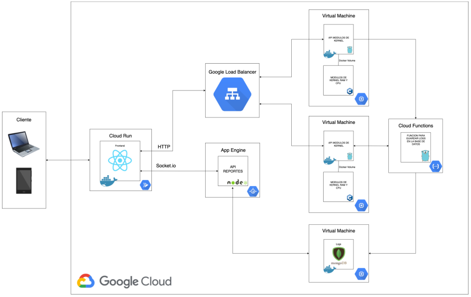

# Proyecto Fase 1 - Manual Técnico
## Introducción
La fase 1 consiste en realizar un sistema computacional distribuído, cloud native, utilizando
diferentes servicios de Google Cloud Platform, virtualización a nivel de
sistema operativo con Docker.

## Herramientas Utilizadas
- Sistema Operativo Linux 20.04 LTS
- Sockets
- React JS
- C
- Golang
- Node
- MongoDB
- Docker
- Docker-Compose
- Docker-Volumes
- Cloud Run
- App Engine
- Google Load Balancer
- Cloud Functions

## Módulos de Kernel
- Módulos de RAM
- Módulos de CPU

## Recursos
- [ Frontend - ReactJS - Cloud Run ](../front)
- [ Api - Virtual Machine - Docker - Golang - C ](../API)
- [ Functions - Cloud Functions - Node ](../Functions)
- [ Sockets - App Engine - Node](../AppEngine)

## Arquitectura Utilizada



### Variables de Entorno
```sh
# URL de la maquina virtual 1 donde se encuentra la API - Golang
REACT_APP_IP_BACKONE

# URL de la maquina virtual 2 donde se encuentra la API - Golang
REACT_APP_IP_BACKTWO

# URL de App Engine donde se encuentran los Sockets - Node
REACT_APP_IP_SOCKET

# Nombre de la maquina virtual en la que se ejecuta la API
VM

# Ruta donde se almacena la data obtenida del módulo de RAM
PATH_RAM

# Ruta donde se almacena la data obtenida del módulo de CPU
PATH_PROC

# URL donde se encuentra la función para almacenar la data de RAM
GCF_RAM

# URL donde se encuentra la función para almacenar la data de CPU
GCF_PROCS
```

### Comandos utilizados en el módulo de kernel
```sh
# Comando utilizado para compilar el archivo que lee la data de CPU y RAM en sus respectivas rutas.
make all

# Comando utilizado para eliminar los archivos compilados en sus respectivas rutas.
make clean

# Comando utilizado para montar el módulo de RAM y CPU respectivamente.
make run

# Comando utilizado para desmontar el módulo de RAM y CPU respectivamente.
make stop
```

### Docker y/o Docker-Compose - Comandos
```sh
# Comandos para ejecutar container de la API
# Comando que ejecuta las instrucciones del archivo docker-compose.yaml, utilizamos el -d para liberar la terminal.
docker-compose up -d

# Comando que detiene la ejecución de las instrucciones del archivo docker-compose.yaml
docker-compose down

# Si no deseamos utilizar docker-compose, podemos utilizar los siguiente comandos de Docker:
# Comando que inicia nuestro contenedor con la imagen de nuestra API
docker run -d -p 8080:8080 --name servergo \
-v /proc/ram_grupo2:/home/procesos/ram_grupo2 \
-v /proc/cpu_grupo2:/home/procesos/cpu_grupo2 \
-e VM=vm1 \
-e PATH_RAM=/home/procesos/ram_grupo2 \
-e PATH_PROC=/home/procesos/cpu_grupo2 \
-e GCF_RAM=us-central1-tallerdocker-341423.cloudfunctions.net/CreateRamLog \
-e GCF_PROCS=us-central1-tallerdocker-341423.cloudfunctions.net/CreateProcLog cristofhers/go_grupo2

# Comando que detiene nuestro contenedor con la imagen de nuestra API
docker stop servergo

# Comandos para ejecutar container del FRONT
# Comando que ejecuta las instrucciones del archivo docker-compose.yml, utilizamos el -d para liberar la terminal.
docker-compose up -d

# Comando que detiene la ejecución de las instrucciones del archivo docker-compose.yml
docker-compose down

# Si no deseamos utilizar docker-compose, podemos utilizar los siguiente comandos de Docker:
# Comando que inicia nuestro contenedor con la imagen de nuestra FRONT
docker run -d -p 80:80 --name frontso1 iguanav/frontso1

# Comando que detiene nuestro contenedor con la imagen de nuestro FRONT
docker stop frontso1
```

## Referencias de la configuración de GCP
- [ Tutorial Cloud Run ](https://youtu.be/ugBRnPDJIOw)
- [ Cloud Functions, Maquinas Virtuales, Load Balancers ](https://drive.google.com/file/d/1xCFTFapOB25PSmTG37WSTwhjBAhPsiv3/view?usp=sharing)