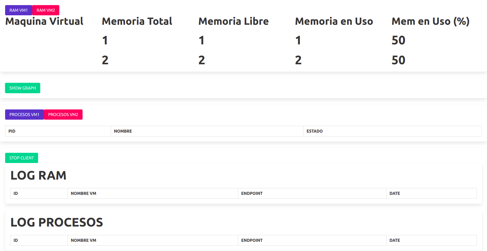
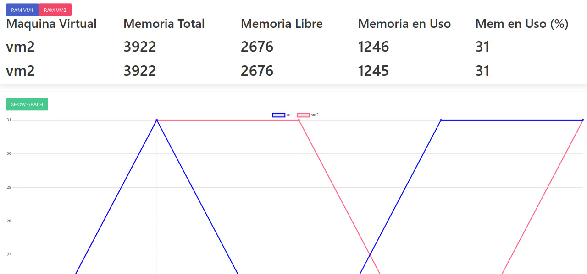
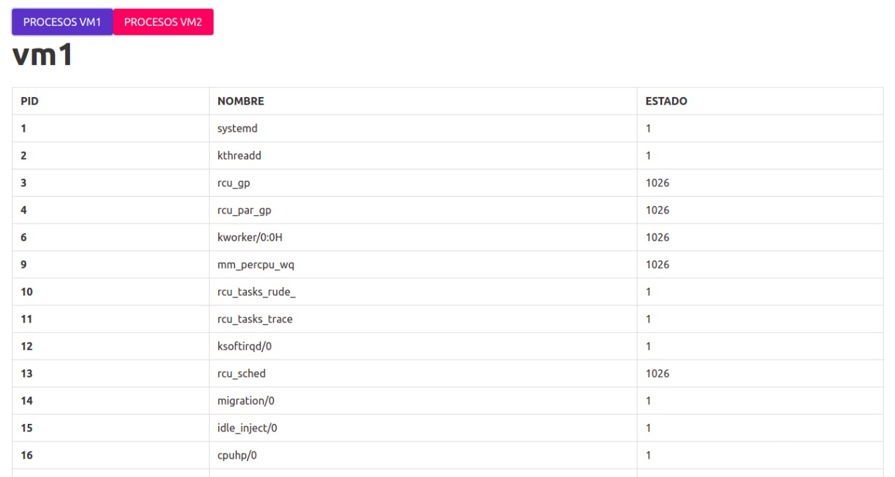
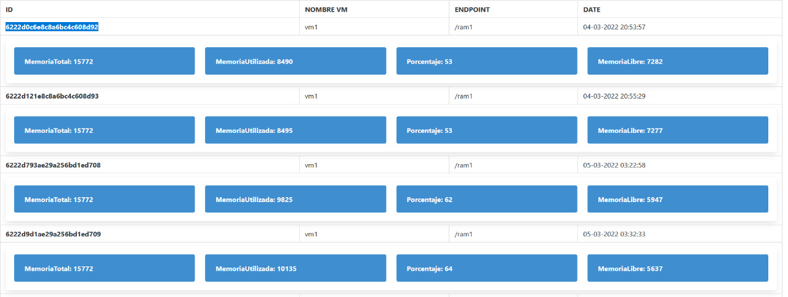
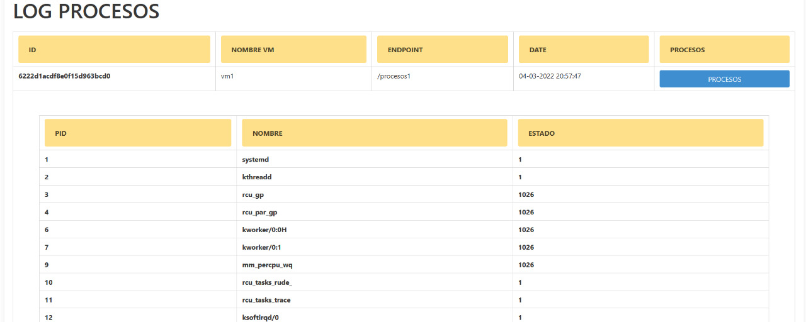

# Proyecto Fase 1 - Manual de Usuario
## Introducción
La fase 1 consiste en realizar un sistema computacional distribuído, cloud native, utilizando
diferentes servicios de Google Cloud Platform, virtualización a nivel de
sistema operativo con Docker.

## Interfaz General

Nuestra interfaz gráfica es una sola página que se divide en diferentes secciones, entre las cuales son:

## Sección Maquina Virtual

### Datos de RAM

Consta de dos botones en la parte superior
- RAM VM1
- RAM VM2

Al precionar cualquiera de los dos botones, se realizara una petición a nuestro balanceador de cargas el cual escogerá a que maquina virtual realizar la petición. La petición devuelve la información de la maquina virtual, datos mostrados en MB:

- Nombre de la maquina.
- Memoria total.
- Memoria libre.
- Memoria en uso.
- Porcentaje de la memoria en uso.

Al precionar el botón SHOW GRAPH nos desplegara u ocultara la gráfica de comparación del uso de la RAM de las maquinas virtuales.

### Datos de CPU

Consta de dos botones en la parte superior:
- PROCESOS VM1
- PROCESOS VM2

Al precionar cualquiera de los dos botones, se realizara una petición a nuestro balanceador de cargas el cual escogerá a que maquina virtual realizar la petición. La petición devuelve la información de la maquina virtual:

- PID.
- Nombre del proceso.
- Estado del proceso.
- Hijos del proceso.

Al hacer click sobre cualquier proceso nos mostrara la lista de los hijos, si cuenta con ellos.

## LOGS

En la parte siguiente a los datos del CPU se encuentra un botón que dice "STOP CLIENT", botón que detiene o inicia el servicio de logs.

### LOGS de RAM

Nos muestra:
- ID de registro.
- Nombre de la maquina virtual.
- Endpoint de la petición.
- Fecha en que se realizó la petición.

Al realizar click sobre cualquier de estos registros nos desplegara los datos de la RAM obtenidos de la maquina virtual.

### LOGS de CPU

Nos muestra:
- ID de registro.
- Nombre de la maquina virtual.
- Endpoint de la petición.
- Fecha en que se realizó la petición.
- Procesos.

Al realizar click en el botón procesos nos desplegara los procesos obtenidos en el registro, al realizar click sobre cualquiera de estos registros nos desplegara los hijos de los procesos si los tuviera.