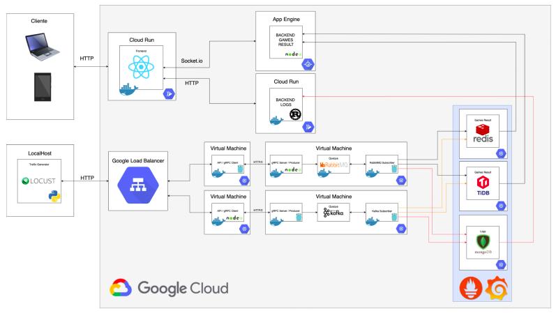

# Proyecto Fase 2 - Manual Técnico
## Introducción
La fase 2 consiste en construir un sistema genérico de arquitectura distribuida que
muestre estadísticas en tiempo real utilizando diferentes servicios de Google
Cloud Platform, virtualización a nivel de sistema operativo con Docker.
Este proyecto se aplicará a la visualización de los resultados de juegos
implementados por los estudiantes.
## Arquitectura Utilizada

## Apache Kafka vs RabbitMQ
Analizando el blog escrito por Martin D Cernadas en agosto de 2021, basándose en articulos publicados por Confluent y TrustRadius, se puede concluir que en términos de velocidad __Apache Kafka__ obtiene una velocidad 15 veces mayor en relación con __RabbitMQ__.
## Ventajas y Desventajas de Apache Kafka y RabbitMQ
### Apache Kafka
#### Ventajas
- Baja latencia
- Tolerancia a fallas
- Durabilidad de los mensajes
- Alta escalabilidad
#### Desventajas
- No tiene un set de monitoreo completo
- No tiene soporte al momento de ingresar mal el nombre del topic, únicamente obtiene los mensajes de un topic exacto
- Reduce el performance cuando se tienen varios brokers y consumers
### RabbitMQ
#### Ventajas
- Permite dar distintas prioridades a los mensajes recibidos
- Escalabilidad
- Fácil uso
#### Desventajas
- No provee ordenamiento de mensajes
- No garantiza la atomicidad
- Los mensajes no persisten, una vez son transmitidos, son eliminados
## Ventajas y Desventajas de RPC y BROKERS
### RPC
#### Ventajas
- Alta velocidad
- Posibilidad de realizar llamadas a terceros
#### Desventajas
- No tiene escalabilidad lineal
- El uso de threads y memoria se ve limitado cuando hacemos llamadas a terceros
### BROKERS
#### Ventajas
- Maneja altos volúmenes de información
- Al estar basado en colas, almacena los mensajes o peticiones que llegan al servidor en el disco, por lo que tiene una alta tolerancia a un mayor número de peticiones
#### Desventajas
- No es tan rápido en comparación con RPC
## Cual es el mejor servio de mensajeria, Apache Kafka o RabbitMQ?
Ambos sistemas de mensajería cumplen con los requisitos básicos por lo que para dar una respuesta sobre cual es mejor tenemos que centrarnos en los detalles de cada mensajería y por el performance que tiene cada una en los puntos en común.
Hablando un poco sobre los puntos específicos, RabbitMQ tiene un mejor desempeño cuando se habla sobre encolar datos. Por otro lado, Apache Kafka soporta streaming de eventos mientras que RabbitMQ no tiene dicho soporte.
Por otro lado, el ruteo que proporciona RabbitMQ es más completo en relación con el ruteo de mensajes que ofrece __Apache Kafka__.
Tomando en cuenta estos parámetros y otros mostrados en el estudio realizado por Confluent, se puede concluir que Apache Kafka tiene un mejor desempeño en comparación a __RabbitMQ__.
## Cual es el mejor sistema, RPC o BROKERS?
Si bien el sistema de RPC nos proporciona una alta velocidad al momento de procesar las solicitudes, debemos de tomar en cuenta que, al momento de recibir una alta cantidad de peticiones, nuestro sistema puede colapsar ya que los recolectores de basura utilizan memoria y consumen recursos que hacen que nuestros procesos se detengan momentáneamente esto hace que nuestro sistema se sature y tengamos error del lado del cliente.
Este tipo de problema desaparece al momento de hacer uso de brokers. Estos brokers proporcionan una cola de procesos por lo que es muy poco probable que presentemos errores del lado del cliente, no obstante, esto tiene un coste de velocidad, por lo que podemos solucionar el problema de memoria y procesamiento, pero vamos a tener una disminución en la velocidad de procesamiento de peticiones. 
Estos problemas únicamente son observados al manejar grandes cantidades de datos, por lo que para aplicaciones de poco tráfico de peticiones, cualquier de los dos sistemas funcionara de la manera esperada.
## Redis VS TiDB
### Redis
Redis es un proyecto de estructura de datos en memoria de código abierto que implementa una base de datos de clave-valor en memoria distribuida con durabilidad opcional.

Popular plataforma de datos en memoria utilizada como caché, intermediario de mensajes y base de datos que se puede implementar en las instalaciones, en las nubes y en entornos híbridos.
### TiDB
TiDB es una base de datos NewSQL distribuida de procesamiento transaccional/analítico híbrido (HTAP) de código abierto que admite las sintaxis MySQL y Spark SQL. Implementa la interfaz de redis.
## ¿Cuál de las dos bases se desempeña mejor y por qué?
La base de datos que se desempeña de una mejor forma es Redis, porque es una base de datos que se viene implementando hace tiempo y es un almacén de estructura de datos en memoria de código abierto (con licencia BSD), que se utiliza como base de datos, caché y agente de mensajes. Admite estructuras de datos como cadenas, hashes, listas, conjuntos, conjuntos ordenados con consultas de rango, mapas de bits, hiperloglogs, índices geoespaciales con consultas de radio y flujos. Redis tiene replicación integrada, secuencias de comandos Lua, desalojo de LRU, transacciones y diferentes niveles de persistencia en disco, y proporciona alta disponibilidad a través de Redis Sentinel y partición automática con Redis Cluster.

## Fuentes de informacion utilizadas
- [RPC vs Messaging which is faster](https://particular.net/blog/rpc-vs-messaging-which-is-faster)
- [RPC and Brokered messaging](https://medium.com/@natemurthy/rest-rpc-and-brokered-messaging-b775aeb0db3)
- [Kafka vs RabbitMQ architecture performance use case](https://www.upsolver.com/blog/kafka-versus-rabbitmq-architecture-performance-use-case)
- [Eligiendo un broker de mensajeria Kafka vs RabbitMQ](https://medium.com/naranja-tech/eligiendo-un-broker-de-mensajer%C3%ADa-kafka-vs-rabbitmq-963326465e4f)
- [Kafka vs Pulsar vs RabbitMQ](https://www.confluent.io/de-de/kafka-vs-pulsar/)
- [Apache Kafka advantages and disadvantages](https://www.javatpoint.com/apache-kafka-advantages-and-disadvantages)
- [Redis y TiDB](https://db-engines.com/en/system/Redis%3BTiDB)
- [Redis VS TiDB](https://www.saashub.com/compare-redis-vs-tidb)
