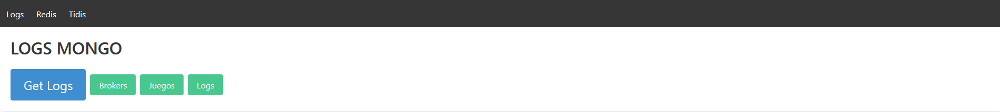
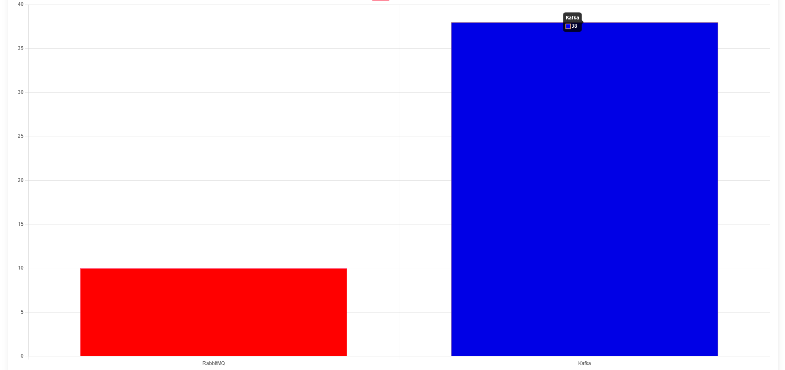
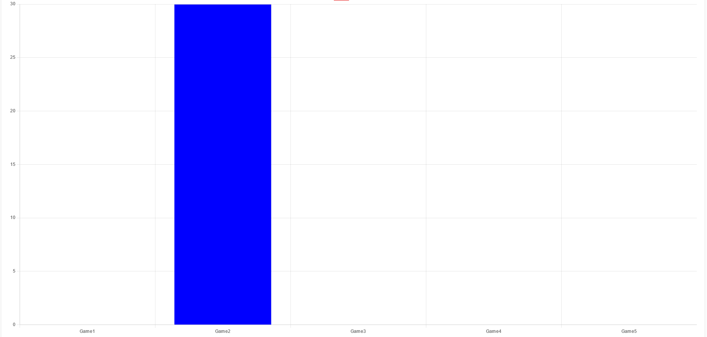
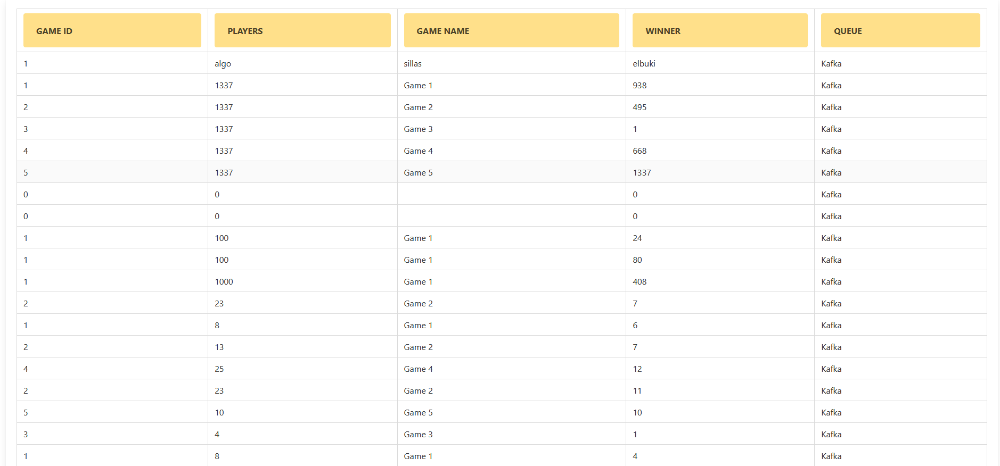
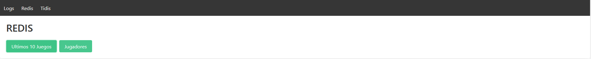
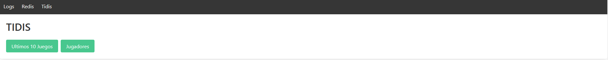
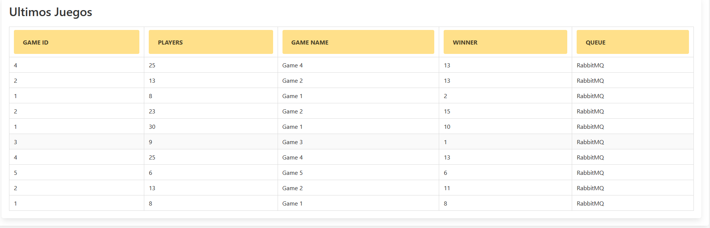
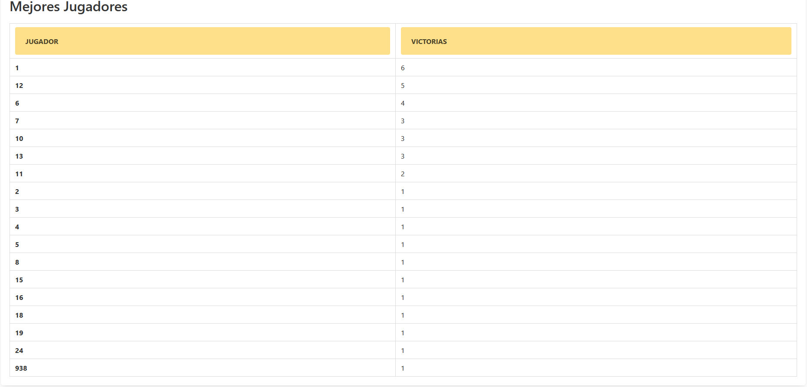
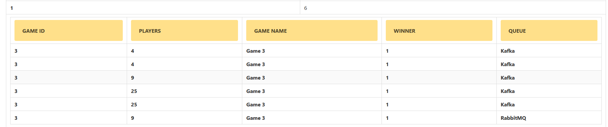

# Proyecto Fase 3 - Manual de Usuario
## Introducción
La fase 2 consiste en realizar un sistema computacional distribuído, cloud native, utilizando
diferentes servicios de Google Cloud Platform, virtualización a nivel de
sistema operativo con Docker.

## Interfaz General

Nuestra interfaz gráfica consta de tres secciones cada una asignada para mostrar los datos almacenados en cada una de las bases de datos utilizadas, se puede navegar a traves de ellas haciendo uso del barra de navegacions:

## Seccion Logs

### Menu de Mongo

Consta de cuatro botones en la parte superior
- Get Logs
- Brokers
- Juegos
- Logs

El boton Get Logs relizara la peticion hacia la api escrita en rust recuperando asi todos los logs almacenados en MongoDB. Cada boton mostrara un grafica o reporte diferente.

### Brokers

Mostrara la cantidad de juegos registrados por cada broker.

### Juegos

Mostrara cuales juegos han sido jugados con mas frecuencia.

### Logs

Mostrara el listado de juegos en orden historico.   
Muestra los siguientes datos:
- GAME_ID
- PLAYERS
- GAME_NAME
- WINNER
- QUEUE

### Menu de Redis

Muestra los registros almacenados por redis, estos se actualizan a si mismos por medio de un socket asi que solo es necesario esperar.

### Menu de Redis

Muestra los registros alamacenados por tidis, funciona de la misma manera que la seccion de redis.

## Reportes de Redis y Tidis
Muestran dos posibles reportes.  
### Ultimos 10 Juegos

Muestra los siguientes datos:
- GAME_ID
- PLAYERS
- GAME_NAME
- WINNER
- QUEUE
### Mejores Jugadores

Muestra los siguientes datos:
- JUGADOR
- VICTORIAS  
Al seleccionar el renglon de alguno de los jugadores mostrara todos los juegos en que el mismo a participado. 
 
Muestra los siguientes datos:
- GAME_ID
- PLAYERS
- GAME_NAME
- WINNER
- QUEUE